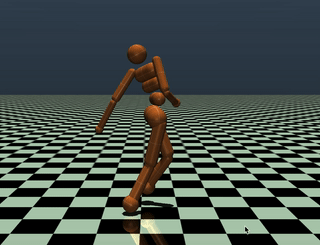

# Humanoid Research (PPO Based)

## Requirements
- python 3.5.2
- openai-gym
- mujoco-1.50.1.56
- pytorch-0.4.1

## Instruction to run the code
the `--dist` contains `gauss` and `beta`. 

### Train the Network with Mujoco:
```bash
mpirun -np 16(I think maybe try 4 in the next time) python -u train_mujoco.py --env-name='Humanoid-v2' --batch-size=64 --lr-decay --ent-coef=0 --total-frames=20000000 --cuda (if you have gpu) 2>&1 | tee exp_humanoid.log

```
### Test the Network with Mujoco
```bash
python demo_mujoco.py --env-name='Humanoid-v2'

```

### Demo: Humanoid-v2 (weird pose)


